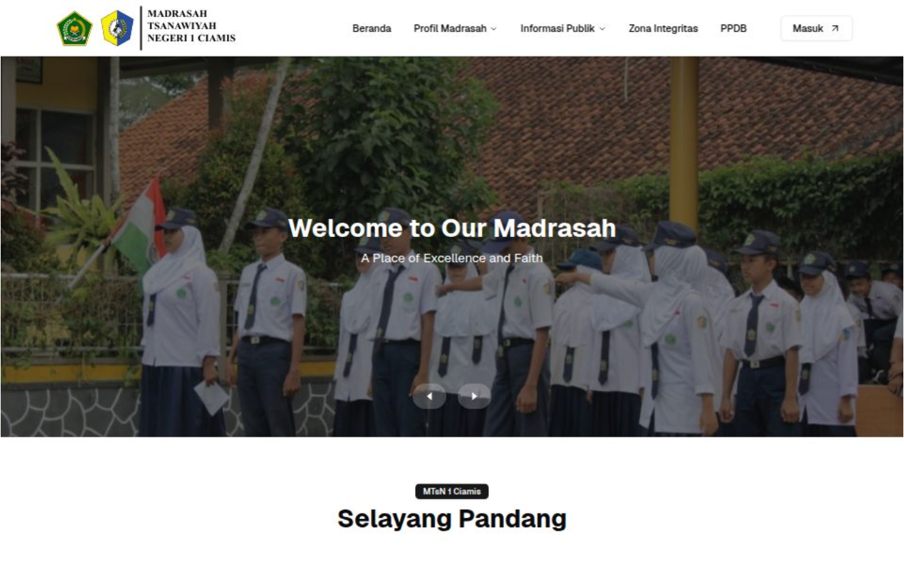

# Matsa App




   

**Matsa App** adalah aplikasi pengelolaan madrasah terpadu yang dikembangkan secara internal oleh MTsN 1 Ciamis. Proyek ini merupakan inisiatif piloting untuk mendigitalisasi berbagai aspek manajemen dan operasional madrasah secara menyeluruh, mulai dari pengelolaan kepegawaian, kurikulum, ujian, hingga layanan siswa dan alumni.

---

## Deskripsi Proyek

Aplikasi ini dirancang sebagai solusi mandiri yang dikembangkan oleh tim internal sekolah, dengan fokus utama pada:

- Manajemen kepegawaian (pegawai, jabatan, beban kerja)  
- Pengelolaan kurikulum dan jadwal pembelajaran  
- Sistem ujian berbasis komputer (CBT)  
- Manajemen surat dan dokumen resmi madrasah (SK, surat tugas, dll)  
- Pengelolaan zona integritas, survei, dan indeks kepuasan pelayanan  
- Pengelolaan komite sekolah (tabungan siswa, sponsorship)  
- Publikasi artikel dan informasi madrasah  
- Fitur PPDB (Penerimaan Peserta Didik Baru)  
- Modul alumni dengan layanan karir untuk lulusan kelas IX  

---

## Tujuan

- Meningkatkan efisiensi administrasi madrasah  
- Mempermudah akses data dan pelaporan  
- Mendukung transparansi dan akuntabilitas pengelolaan madrasah  
- Menyediakan platform digital yang dapat dikembangkan dan di-maintain oleh tim internal  

---

## Status Proyek

- Proyek ini merupakan proyek piloting dan masih dalam tahap pengembangan aktif.  
- Saat ini pengembangan dilakukan oleh satu orang (developer internal MTsN 1 Ciamis).  
- Kontribusi dari pihak lain sangat dihargai, namun pengelolaan kode dan keputusan teknis masih dikelola secara terpusat.

---

## Struktur Folder (singkat)

   ```bash
app/                   # Routing & halaman Next.js (App Router)
├── admin/             # Modul dan halaman khusus admin
├── public/            # Halaman dengan akses publik (view-only)
├── zona-integritas/   # Modul zona integritas madrasah
├── komite/            # Modul pengelolaan komite sekolah
├── alumni/            # Modul alumni (layanan karir)
├── ppdb/              # Modul penerimaan peserta didik baru
└── ...                # Modul lainnya sesuai kebutuhan

components/            # Komponen UI reusable, bersifat presentasional

hooks/                 # Custom React hooks untuk logic reusable

lib/                   # Library internal dan helper
├── api/               # Fungsi pemanggilan API dan service layer
├── context/           # React context provider & consumer
├── enums/             # Enumerasi konstan yang digunakan di aplikasi
├── helpers/           # Fungsi bantu (utility functions spesifik)
├── interfaces/        # Definisi tipe dan interface TypeScript
├── middleware/        # Middleware Next.js (auth, logging, dll)
├── services/          # Layanan khusus (misal integrasi Supabase, Google API)
└── types/             # Type alias atau global types

utils/                 # Utilitas umum yang lebih kecil dan generik

public/                # Aset statis (gambar, favicon, fonts, dll)

secrets/               # File konfigurasi sensitif (di .gitignore)

tests/                 # Unit/integration tests (optional tapi direkomendasikan)

```

---

## Cara Menjalankan

1. Clone repositori ini  
2. Install dependencies:  
   ```bash
   npm install
   # atau
   yarn install
3. Install dependencies:  
4. Buat file .env.local dengan konfigurasi environment yang diperlukan (contoh ada di .env.example)

5. Install dependencies:  Jalankan aplikasi secara lokal:
   ```bash
   npm run dev
   # atau
   yarn dev
6. Buka http://localhost:3000 di browser


## Catatan
Pastikan file client_secret.json untuk Google API disimpan di folder secrets/ dan tidak di-commit ke repositori publik.

Dokumentasi tambahan dan changelog akan diperbarui secara berkala.

## Kontak
Untuk informasi lebih lanjut, hubungi developer internal MTsN 1 Ciamis.

[ GitHub](https://github.com/)